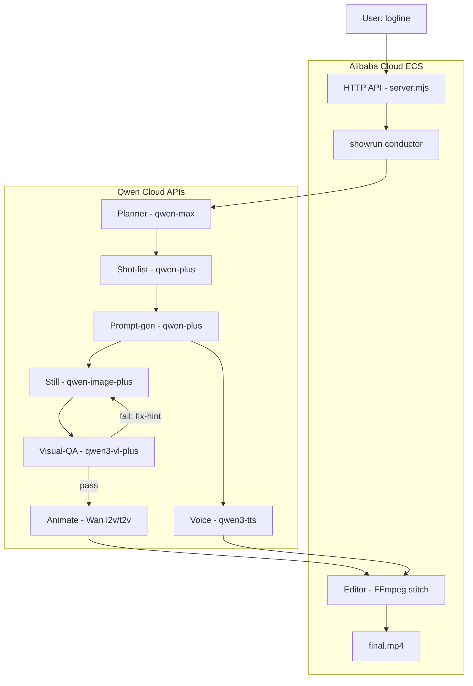

# Architecture — Qwen Showrunner

An autonomous AI short-film agent. A logline goes in; a finished, edited MP4 comes
out — planned, generated, quality-checked, voiced, and stitched with no human in the
loop. Every model call is a **Qwen Cloud** API; the backend runs on **Alibaba Cloud ECS**
with no local GPU.

## Pipeline
1. **Plan** — `qwen-max` turns the logline into story beats (scenes).
2. **Shot list** — each scene becomes ordered shots (type, i2v/t2v, duration).
3. **Prompt-gen** — each shot becomes a crafted still + motion prompt (one at a time).
4. **Render + QA loop** — a still is generated (`qwen-image-plus`); a Qwen-VL agent checks
   prompt-match / spelling / anatomy and regenerates with feedback until it passes (or keeps
   the best-scoring attempt).
5. **Animate** — Wan image-to-video animates the approved still; text-to-video for complex motion.
6. **Voice** — `qwen3-tts` narrates each shot's lines.
7. **Stitch** — FFmpeg normalizes and concatenates every shot into the final cut.

## Qwen Cloud usage
| Stage | Model | Endpoint |
|---|---|---|
| Plan / shot list / prompt-gen | qwen-max, qwen-plus | OpenAI-compatible chat |
| Visual QA | qwen3-vl-plus | OpenAI-compatible (vision) |
| Stills | qwen-image-plus | DashScope async task |
| Video | wan2.6-i2v-flash / wan2.6-t2v | DashScope async task |
| Voice | qwen3-tts-flash | DashScope generation |

All endpoints share one key against `dashscope-intl.aliyuncs.com`. See `API_NOTES.md` for
exact request shapes. The conductor and FFmpeg run on ECS; all generation is offloaded to
Qwen Cloud, so the box needs no GPU.

## Multi-agent design
Five cooperating agent roles — Planner, Director (shot list), Prompt Engineer, Visual-QA
reviewer, and Editor — each a discrete model call with its own contract, coordinated by the
`showrun` conductor. The Visual-QA reviewer forms a closed correction loop with the renderer.
