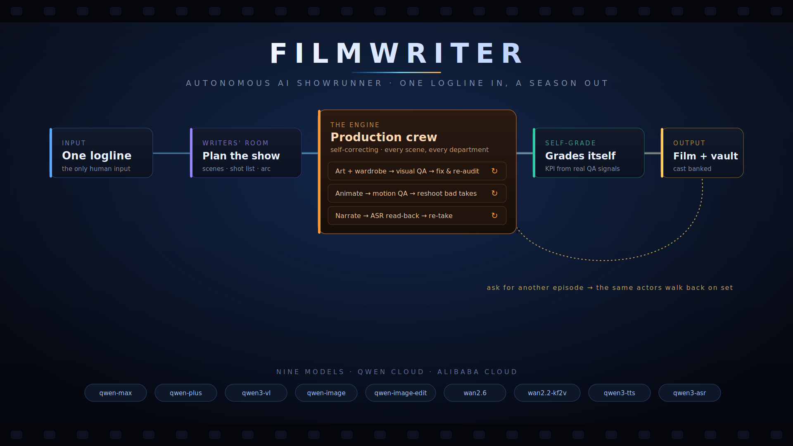

# Filmwriter — Autonomous AI Auteur

> One logline in; a finished, edited short out.

**Global AI Hackathon with Qwen Cloud · Track 2 (AI Showrunner)** · repo: `Qwen-Filmwriter`

A logline goes in; a finished, edited short film comes out — planned, generated,
quality-checked, voiced, and stitched with **no human in the loop**. Built entirely on
**Qwen Cloud** (Qwen3, Qwen-VL, Qwen-Image, Wan, qwen3-tts) and deployed on **Alibaba Cloud**.

See [`ARCHITECTURE.md`](ARCHITECTURE.md) for the diagram and [`API_NOTES.md`](API_NOTES.md) for verified API shapes.

## Pipeline — 5 cooperating agents
`Planner → Shot-list → Prompt-gen → [Render → Visual-QA loop → Animate] → Voice → Stitch`

The Visual-QA agent (Qwen-VL) inspects every still for prompt-match, spelling, and anatomy,
and regenerates with feedback until it passes — a closed self-correction loop.

## Run
Requirements: Node 18+, FFmpeg on PATH, a Qwen Cloud key in `.env`:
```
QWEN_BASE_URL=https://dashscope-intl.aliyuncs.com/compatible-mode/v1
QWEN_API_KEY=sk-...
```

Make a film from a logline:
```
node --env-file=.env test_showrun.mjs "a lonely android busker discovers it can dream"
# -> output/film/final.mp4
```

Plan only (no video spend):
```
node --env-file=.env test_storyboard.mjs "your logline"   # -> output/film/storyboard.json
```

HTTP service (the deployable surface):
```
node --env-file=.env server.mjs
# POST /showrun {"logline":"...","scenes":3}  -> { jobId }
# GET  /jobs/:id                              -> status + live log
# GET  /jobs/:id/film                         -> final.mp4
```

## Status
- [x] Qwen Cloud client (chat, vision, image, video, tts) — verified live
- [x] Multi-agent pipeline, autonomous end-to-end run producing `final.mp4`
- [x] Self-correcting visual-QA loop
- [x] Async job HTTP API
- [ ] Alibaba Cloud ECS deployment + proof recording
- [ ] 3-minute demo video


## Architecture



One logline in, a season out: writers' room -> self-correcting production crew -> self-grade -> film + season vault. Nine models on Qwen Cloud.
